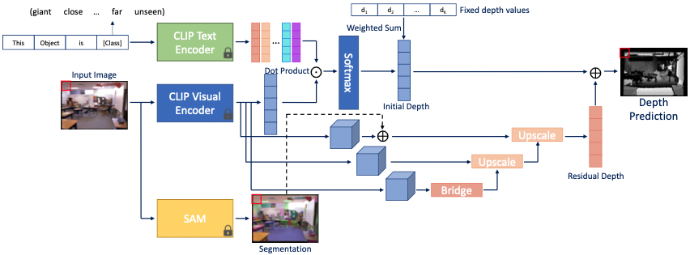
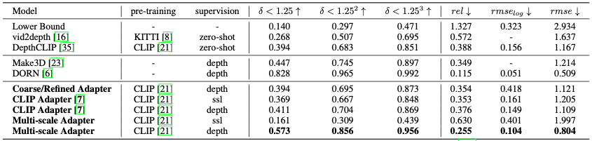
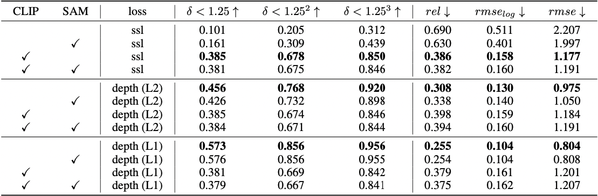
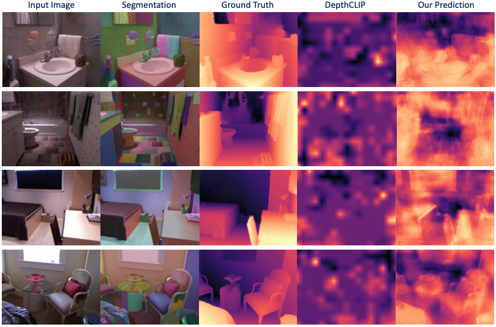

# Unveiling-the-Efficacy-of-Foundation-Models-for-Depth-Estimation

## Overview
### Task
Monocular depth estimation is critical for 3D reasoning of a scene. While inferring from 2D to 3D is an ill-posed problem, it is challenging to recover the depth of a scene given the scarcity of depth supervisions. In this project, we aim to investigate the feasibility of using large foundation models, such as [Contrastive Language-Image Pre-training (CLIP)](https://openai.com/research/clip) and [Segment Anything (SAM)](https://segment-anything.com/), for depth estimation in computer vision.

Inspired by [depthCLIP](https://arxiv.org/abs/2207.01077), we first formulate depth estimation as a distance classification task so that distance can be *inferred* from CLIP with semantic language tokens, which serves as the initial depth prediction. We then incorporate adapter networks to study whether these refinement modules can further improve the CLIP predictions, including [CLIP-Adapter](https://arxiv.org/abs/2110.04544) and the proposed Multi-Scale Adapter (MSA).

In addition, we investigate the efficacy of SAM for depth estimation by integrating its output into the multi-scale adapter. We conduct thorough experiments and ablation studies under both self-supervised and supervised settings with the NYU-Depth v2 Dataset. Experimental results suggest that, while showing promising performance on classification and segmentation tasks, current visual foundation models still suffer from 2D-to-3D reasoning and fail to address the challenge of depth estimation in computer vision.


<!---->


### Dataset
- NYU-Depth v2 Dataset: NYU-Depth v2 is a popular dataset of indoor scenes. It comprises video sequences recorded by both the RGB and Depth cameras from the Microsoft Kinect. The dataset includes various indoor scenes, such as offices, bedrooms, kitchens, and living rooms, covering a wide range of objects, furniture, and room layouts.


## Code
### Prerequisites
```
conda env create --file depthclip.yml
```

### Training
- Data Preparation

    * NYU-Depth v2 Dataset
    Please visit the official NYU Depth v2 dataset website: http://cs.nyu.edu/~silberman/datasets/nyu_depth_v2.html to download the dataset.


    * Segment Anything (SAM) Results of NYU-Depth v2 dataset
    Please download SAM results of [Training set](https://www.dropbox.com/scl/fo/yphwus7aoh18kjt3f9tai/h?dl=1&rlkey=h150zbh113fg8tnzrufmmtkeq) and [Testing set](https://www.dropbox.com/scl/fo/wecn08bpw9q49p9pqvqm7/h?dl=1&rlkey=qih6jodtz1qjv5quvj4mj1t88) from the links.


- Reimplement depth_eigen
```
# train
python eigen/train.py --config1 configs/nyu/eigen/depth_eigen_coarse/RN50.yml --config2 configs/nyu/eigen/depth_eigen_refine/RN50.yml

# eval coarse prediction
python eigen/eval.py --config configs/nyu/eigen/depth_eigen_coarse/RN50.yml

# eval coarse+refined preidction
python eigen/eval.py --config configs/nyu/eigen/depth_eigen_refine/RN50.yml
```

- CLIP Adapter
```
python train.py --config configs/nyu/depth_adapter/RN50.yml
```

- Coarse/Refined Adapter
```
python eigen/train.py --config1 configs/nyu/eigen/depth_coarse/RN50.yml --config2 configs/nyu/eigen/depth_refine/RN50.yml
```

- Multi-scale Adapter (MSA)
```
python train.py --config configs/nyu/depth_convadapter/RN50.yml
```

### Evaluation
- CLIP Adapter
```
python eval.py --config configs/nyu/depth_adapter/RN50.yml
```

- Coarse/Refined Adapter
```
# eval coarse prediction
python eigen/eval.py --config configs/nyu/eigen/depth_coarse/RN50.yml

# eval coarse+refined preidction
python eigen/eval.py --config configs/nyu/eigen/depth_refine/RN50.yml
```

- Multi-scale Adapter (MSA)
```
python eval.py --config configs/nyu/eigen/depth_convadapter/RN50.yml
```

## Results
### Quantitative Results

<!---->

### Ablation Studies

<!---->

### Visualization

<!---->
